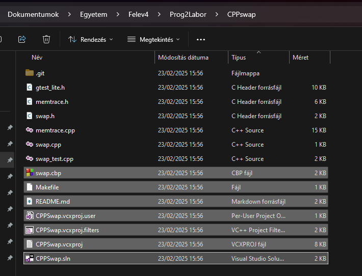
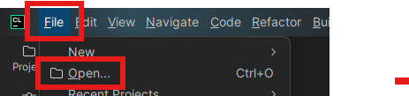
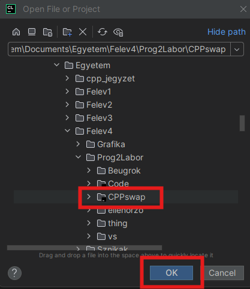
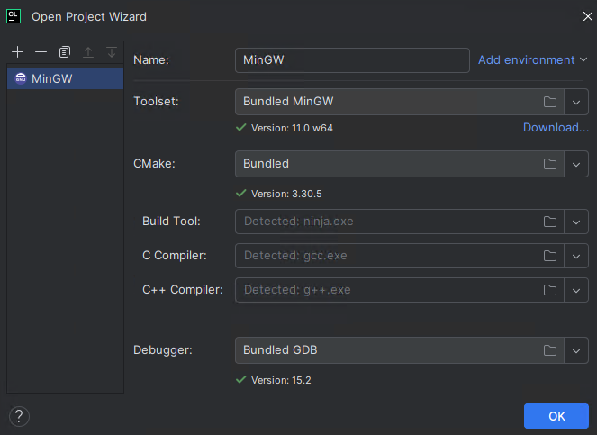
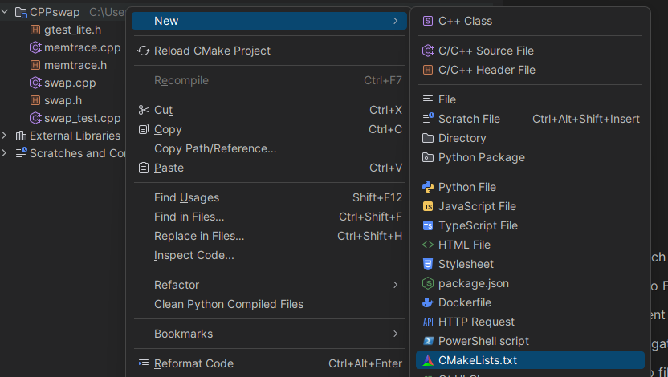
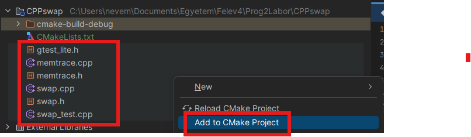
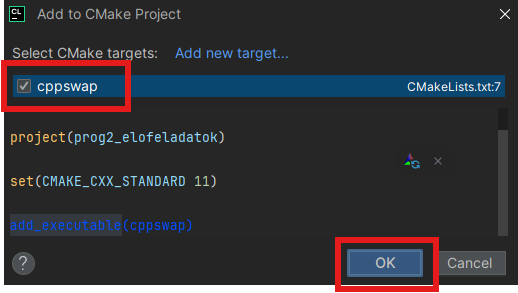
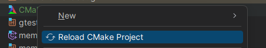
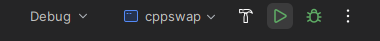

# CLion

## Aktiválás

!!! note
    A CLion 2025. májusa óta ingyenes non-commercial használatra.

A CLion egyetemisták számára ingyenes, ehhez licenszet kell igényelni.

A <https://www.jetbrains.com/shop/eform/students> oldalon az `edu.bme.hu` emaillel (címtárból készíthető) kell jelentkezni a licenszért.

Egy JetBrains account -ot is kér majd az applikáció végén, ennek az adatait érdemes megjegyezni, ehhez lesz kötve a licensz. Ha esetlen visszaigazoló email jön, az edus email címet pl. Outlook -ból (vagy bármilyen más email kliensből) lehet elérni.

## CMake

A CLion a CMake nevű build systemet használja. Bővebben itt: <https://nevemlaci.github.io/cpp_jegyzet/999-ide-cmake.html>

Különböző CMake targetek közt váltani az ablak jobb felső részében tudunk.

## Példa CPPSwap feladat betöltésére

Törlünk mindent, ami nem C/C++ header / source file:







Ha még sosem volt megnyitva a CLion, vagy még nem lett egy CMake preset sem beállítva, akkor ezt az ablakot látjuk:



A tárgy számára az alapértelmezett beállítások tökéletesen megfelelnek.

Jobbklikk a projekt mappára > New > CMakeLists.txt



Bemásoljuk a CMakeLists -be ezt:

```cmake
cmake_minimum_required(VERSION 3.25) 

project(prog2_elofeladatok)

set(CMAKE_CXX_STANDARD 11)

add_executable(cppswap)
```

CMake -ről bővebben egy másik fejezetben már írtam.

Kiválasztjuk az összes C/C++ header / source file -t > Jobb klikk > Add to CMake Project <br>(Ha ez az opció nem jelenik meg, akkor a CMakeLists.txt -re jobb klikk > Load CMake Project)





Jobb klikk CMakeLists.txt -re > Reload CMake Project



Jobb fent valami ilyesminek kéne megjelennie: 



A zöld háromszögre kattintva lehet a kiválasztott target-et elindítani, a bogárra kattintva lehet debuggert indítani.