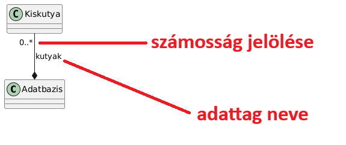

# Házi feladat tippek

### Nagyházi linkek: 
[kiírás](https://infocpp.iit.bme.hu/nhf), 
[ötletek](https://infocpp.iit.bme.hu/hf_otlet), 
[pontozási útmutató](https://infocpp.iit.bme.hu/sites/default/files/HF%20Pontozás_0.pdf), 
[példa nhf](https://git.ik.bme.hu/Prog2/ell_feladat/NHF)

## Kompozíció és adattagok

Ha `A` tartalmazza `B`-t, akkor nem kell `A`-ban egy `B` típusú adattag ÉS kompozíció a kettejük közt. Elég a kompozíció és annak elnevezése:

Emellett érdemes jelölni a számosságot: `min_amount .. max_amount`. A végtelent a `*` jelöli.

A példán egy kutyákat nyilvántartó adatbázis példa látható:


## HF tesztelése, feltételes fordítás

A JPorta a házikat C++17 módban, `-Werror -Wall -pedantic` warning flagekkel fordítja.

A JPorta definiálja a `CPORTA` makrót, ennek segítségével lehet kódot csak JPortán, vagy csak nem JPortán fordítani:

```cpp
#ifdef CPORTA
//ez csak jportán fut
#endif

#ifndef CPORTA
//ez csak akkor fut, ha nem JPorta fordította
#endif

//kető egyben (ifelse)

#ifdef CPORTA
//csak jporta
#else
//csak nem jporta
#endif
```

## Input és output mockolás

Tegyük fel hogy van néhány már elkészített teszt makrónk. Ilyeneket lehet pl a `gtest_lite` felhasználásával szerezni.

* `EXPECT_EQ`: egyenlőséget vár el a két argumentuma közt
* `EXPECT_THROW`: kivételt vár

Ha azt szeretnénk tesztelni, hogy jól reagál -e adott inputra a program, akkor van két opciónk:
* Standard inputról olvasunk egy egységtesztben: ezt nem szeretjük
* "Mock" -olunk egy inputot, ezt szokás csinálni

Ehhez az `std::stringstream` típust fogjuk használni. Ez hasonló, mint az eddig megismert standard IO streamek. A stringstream egy belső karaktertömbbe ír és onnan olvas. Tetszőlegesen írhatunk bele és olvashatunk is belőle, nagyon hasznos, könnyen lehet vele pl. szám > string konverziót végezni. Az `sstream` standard headerben található.

Most egy egyszerű kétdimenziós vektorhoz írunk két tesztet:
```cpp
std::stringsteam mocked_input;
mocked_input << "1, 2"; //beletesszük az adatokat az elvárt formátumban
vec2 v;
mocked_input >> v; //kiolvassuk a vektorba az adatokat
EXPECT_EQ(vec2(1, 2), v);
```

Most pedig egy teszt, ahol szándékosan rossz formátumot használunk:
```cpp
std::stringsteam mocked_input;
mocked_input << "1| 2"; //beletesszük az adatokat szándékosan rossz formában
vec2 v;
EXPECT_THROW(mocked_input >> v); //hibás volt a bemenet, ezért kivételt várunk
```