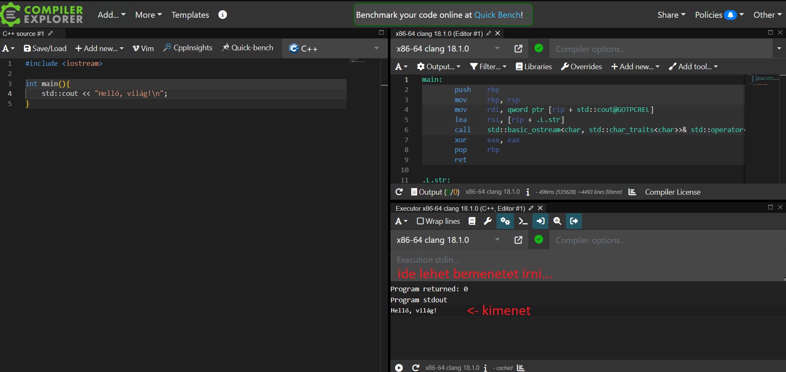

# A jegyzetről

* Ha hibát találsz a jegyzetben, azt kérlek jelezd a <https://github.com/nevemlaci/cpp_jegyzet/issues> oldalon.
* Ha a jegyzetből használsz kódrészletet, kommentben jelezd, hogy innen van. (főleg háziban, plágium elkerülése végett!)

***FONTOS!*** A C++ nyelv a népszerű nyelvek között az egyik legnehezebb, elsajátítása megfelelő figyelmet és erőbefektetést igényel. A jegyzetben minden sornak jelentése van, azokban potenciálisan olyan információ rejlik, amely később kritikus tudásként szolgálhat. Érdemes minden sort elolvasni és értelmezni a kódrészleteket. A programozás tényleges megtanulásához elengedhetetlen, hogy hallgatóként a programozásra hobbiként is tekintsünk.

A jegyzet A Programozás Alapjai 2 című tárgyhoz készült, viszont egyes esetekben kitérőket tesz, hogy az esetleges C++ nyelv iránt érdeklődő hallgatókat elmélyítse a nyelv szépségeiben.

A jegyzetben próbáltam a tananyag menetéhez alkalmazkodni, csak akkor változtattam, amikor a tananyagban esetleg érdemesebbnek láttam egyes fogalmakat hamarabb bevezetni.

A legtöbb anyaghoz találhatóak külső linkek hasznos oldalakhoz, azonban egyesek(pl. cppreference) kicsit bővebben elmagyaráznak egyes aspektusokat, mint ami a tárgyhoz szükséges.

Ezen felül fontos azt megjegyezni, hogy a tárgy C++ verzióban inkonzisztens(pl. egyes ellenőrző feladatok C++03-ra vannak állítva), néhány laboron működni fog az, ami a másikon nem. Viszont a házi feladatban *elvileg* C++17 verzióval fordul minden.
A laborokon elvileg lehet (és Windowson ezt ajánlom!) Visual Studioban dolgozni, ami viszont C++14-nél régebbi verziókat nem támogat. 

## Compiler Explorer (Godbolt)

A [Compiler Explorer](https://godbolt.org/z/xPK1P37P8) egy weboldal, ahol mindenféle nyelven írt programok különböző fordítókkal készített kimenetét lehet megnézni. A linkre kattintva egy egyszerű setupot kapunk, amelyen a bal oldalra írt kódot a jobb oldalon optimalizálás nélküli Assemblyként láthatjuk, valamint egy "Executor" is jelen van, amely a kód futtatását szimulálja. (Ha nem érdekel az assembly, azt a tabot nyugodtan bezárhatod, telhesen független az Executor-tól.)

A jegyzetben a hosszabb/bonyolultabb kódrészletekhez csatoltam godbolt linkeket, így gyorsan csekkolható a program futása, valamint így gyorsan bele lehet piszkálni a kódba.

    

## Inspiráció

A jegyzet inspirációt merít az [infocpp](https://infocpp.iit.bme.hu)(hivatalos tárgyhonlap, tananyag), [CPPFTW](https://prog2.cppftw.org)(hallgatók által készített majdnem kész jegyzet) és a [cppreference](https://en.cppreference.com/w/) weboldal tartalmából.

Köszönöm a [TCCPP](https://discord.gg/tccpp) Discord szerver tapasztalt (gcc közreműködők, C++ ISO tanács tagok) tagjainak az esetleges szakmai kérdések megválaszolását.

- volatile
- Mr. Σ
- Eisenwave
- dot
- DXPower
- Mindenki, esetleg nem említett közreműködő...

Az "Alapvető különbségek a C nyelvtől" fejezet alcímeit és tartalmát részben a CPPFTW oldal inspirálta.